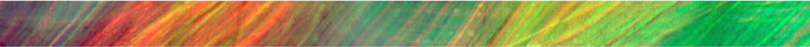

<h1 align="center">Mouse-Cular_Denervation</h1>

<em>Unravelling the molecular changes of fast glycolytic muscle fibers during denervation</em>

  

* **snRNA-Seq_Analysis** : This code allows an analysis and the integration of snRNA-Seq data sets.
* **snMultiome_Analysis** : This code allows an analysis and the integration of snRNA-Seq & snATAC-Seq data sets.
* **Automatic_annotation** : This code takes as input a csv with the markers for each cluster and returns a tsv with, for each gene in each cluster, the cell type where the gene is expressed according to the Human Protein Atlas.
